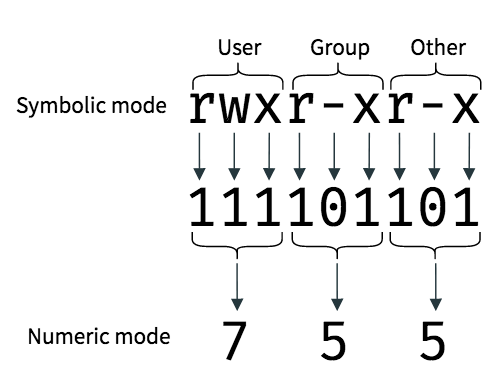

# Modifying file permissions

The `chmod` command is how you modify the permissions associated with
files and directories. The `chmod` command has two different ways to modify
permissions: symbolic and absolute. Symbolic permissions have the same format as
the access mode output of `ls -l`.
In this mode, you use the characters `r`, `w`, and `x` to
set the read, write, and execute permissions. The other mode, absolute,
instead uses a series of three numbers to correspond to the permissions for
the owner, group, and others. These numbers are identical in meaning to the
symbolic mode breakdown, they are just more compact and therefore
quicker to type. Here is an example of how the two modes relate from Boolean World:

>_NOTE:_ This example refers to absolute mode as numeric mode. These two terms
are interchangeable and you will commonly see both.

Image credit: Boolean World, ["An Introduction to Linux File Permissions"](https://www.booleanworld.com/introduction-linux-file-permissions/)

The crucial takeaway is that each character in a symbolic permission can be converted
to a binary number, 1 if the user has that permission and 0 if the user does not.
These three binary numbers become a single octal digit, and three such octal
digits compose an absolute representation of the file's permissions.  

The upcoming sections walk through a examples of changing permissions using
each of these two modes.

# Changing permissions (symbolic)

In this step, you will be modifying the permissions on the `status.sh` script
using symbolic syntax with the `chmod` command. In the previous step, you were
unable to execute __status.sh__ as __guest__. To change that, use the `chmod`
command. In this case, you are going to do two operations in one line. You are
going to use `g+r`. The plus `+` operator will add any permissions
that you specify, but it will not change any permissions that you do not explicitly
set in the command. So in this case, it will give users in the file's group
read access, but will not change the value of write or execute access for the group.
The permissions for others will be set explicitly with `o=rwx`.
Using the equals `=` operator means that you wish to completely define the
permissions for that set of users. Return to the root terminal to execute this command.

`chmod g+r,o=rwx status.sh`{{execute T1}}

Verify that this command succeeded using `ls -l`. Also use `grep` to single in
on the line describing __status.sh__.

`ls -l | grep status.sh`{{execute T1}}

<pre class=file>
-rwxr-xrwx. 1 root root  66 Jun  2 22:42 status.sh
</pre>

>_NOTE:_ Just as `g+w` added write permissions for the group, `chmod` accepts
a `-` argument to take away permissions. For example, `o-wx` would remove write
and execute privileges from the others group while leaving the read value untouched.  

Now the __guest__ user will be able to read, write, and execute __status.sh__.
Switch back to the guest terminal and re-run the status script:

`./status.sh`{{execute T2}}

<pre class=file>
status.sh successfully executed by guest
</pre>

Since you added read, write, and execute permissions, you can do more than
just execute this file as __guest__. Use the `cat` command to verify that you
can read this file as __guest__.

`cat status.sh`{{execute T2}}

<pre class=file>
#!/bin/bash

echo -n "status.sh successfully executed by "
whoami
</pre>

Symbolic mode is the more expanded permissions format which can appeal to
newer users. However, the absolute mode described in the next step can
save on keystrokes if you take the time to familiarize yourself with it.
