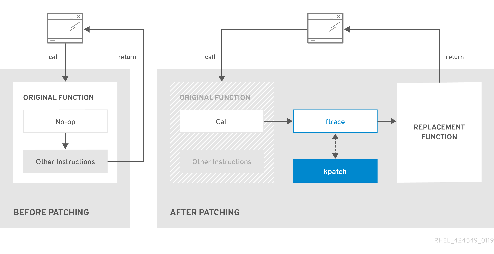

# 利用可能な Kernel Live Patch を判定する

Kernel Live Patchがカーネルに適用されると、カーネル内の関数は初期命令から再ルーティングされ、代わりに kpatch によって提供される関数が使用されます。 次の図は、このプロセスがどのように動作するかについてもう少し詳しく説明しています。

Image from the [Red Hat Kernel Adminstration Guide](https://access.redhat.com/documentation/en-us/red_hat_enterprise_linux/7/html/kernel_administration_guide/applying_patches_with_kernel_live_patching)

これは、kpatch がカーネルの特定のバージョンに結び付けられて作成されていることを意味します。 利用可能なカーネルパッチを見る前に、まず、対象システムで動作しているカーネルのバージョンを知る必要があります。

`uname -r`{{execute}}

<pre class=file>
4.18.0-305.el8.x86_64
</pre>

ラボのシステムでは、カーネルのバージョン(リリースとも呼ばれているため、uname では -r オプションを使います) 4.18.0-193.el8.x86_64 を実行しています。

ラボマシンで動作しているカーネルのバージョンがわかったので、Red Hat Enterprise Linux のリポジトリから入手可能な kpatch パッケージをすべて見てみましょう。

`yum list available kpatch-patch*305*`{{execute}}

<pre class='file'>
<< 出力省略 >>

Available Packages
kpatch-patch-4_18_0-305.x86_64              1-1.el8 
kpatch-patch-4_18_0-305_3_1.x86_64          0-0.el8_4 

</pre>

上記の出力から、いくつかの異なる kpatch-patch パッチが利用可能ですが、あなたのシステム上で動作するカーネル用のパッチはそのうちの 1つだけであることがわかります。 システムに必要なのは `kpatch-patch-4_18_0-305_3_1.x86_64` で、これは `uname -r` で報告されたカーネルのバージョン、具体的には 4.18.0-305.el8 に対応します。

他の kpatch-patch パッケージ、たとえば `kpatch-patch-4_18_0-147.x86_64` は、別のカーネル、具体的にはバージョン 4.18.0-147 に対応しています。列挙されているその他のものは、システム上で実行されているカーネルのリリースではなく、他のカーネルのリリースに対応することがわかります。

次のステップでは、あなたのシステムで利用可能なkpatchをカーネルに適用します。
