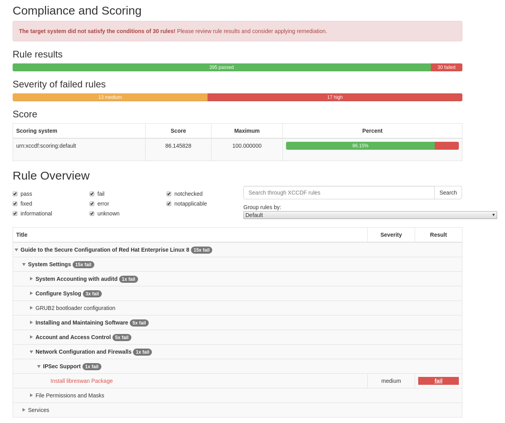

# Scan and generate a report

A XCCDF document is a structured collection of security configuration rules for some set of target system. In this case, it has the 
configuration rules that meet the PCI regulation.

To start scanning using OpenSCAP, use the *oscap xccdf eval* command with the profile Id, option to fetch remote resources, output XML results file, and 
the datastream file.

`oscap xccdf eval --fetch-remote-resources --profile xccdf_org.ssgproject.content_profile_pci-dss --results /tmp/scan-xccdf-results.xml /usr/share/xml/scap/ssg/content/ssg-rhel8-ds.xml`{{execute T1}}

__Note:__ This scan can take a few minutes to complete as it has to evaluate all the rules, and generate a XML file that has the results.

Once the scan completes, you can look at the pass/fail status of each rule in the output -

<pre class="file">
Downloading: https://www.redhat.com/security/data/oval/com.redhat.rhsa-RHEL8.xml ... ok
Title   Enable auditd Service
Rule    xccdf_org.ssgproject.content_rule_service_auditd_enabled
Ident   CCE-80872-5
Result  pass

Title   Enable Auditing for Processes Which Start Prior to the Audit Daemon
Rule    xccdf_org.ssgproject.content_rule_grub2_audit_argument
Ident   CCE-80825-3
Result  pass

Title   Configure auditd mail_acct Action on Low Disk Space
Rule    xccdf_org.ssgproject.content_rule_auditd_data_retention_action_mail_acct
Ident   CCE-80678-6
Result  pass

Title   Configure auditd admin_space_left Action on Low Disk Space
Rule    xccdf_org.ssgproject.content_rule_auditd_data_retention_admin_space_left_action
Ident   CCE-80679-4
Result  pass

Title   Configure auditd Number of Logs Retained
Rule    xccdf_org.ssgproject.content_rule_auditd_data_retention_num_logs
Ident   CCE-80683-6
Result  pass

Title   Configure auditd max_log_file_action Upon Reaching Maximum Log Size
Rule    xccdf_org.ssgproject.content_rule_auditd_data_retention_max_log_file_action
Ident   CCE-80682-8
Result  pass

Title   Configure auditd space_left Action on Low Disk Space
Rule    xccdf_org.ssgproject.content_rule_auditd_data_retention_space_left_action
Ident   CCE-80684-4
Result  pass

Title   Configure auditd Max Log File Size
Rule    xccdf_org.ssgproject.content_rule_auditd_data_retention_max_log_file
Ident   CCE-80681-0
Result  pass

<< OUTPUT ABRIDGED >>
</pre>

The XML results file can be transformed into HTML or plain-text format for easier readability - 

`oscap oval generate report /tmp/scan-xccdf-results.xml > /var/www/html/index.html`{{execute T1}} 

Now that the HTML report is generated, you can check the *OpenSCAP Report* tab of this lab interface to view the results.

From the report, you will notice that there are about 30 or so rules that have failed, and the next steps will focus on remediating an issue that was found.
